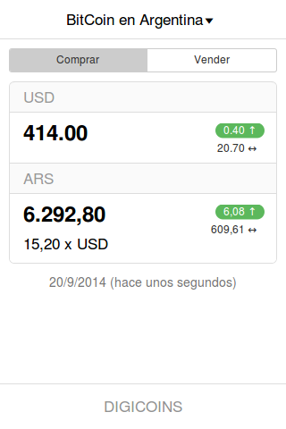
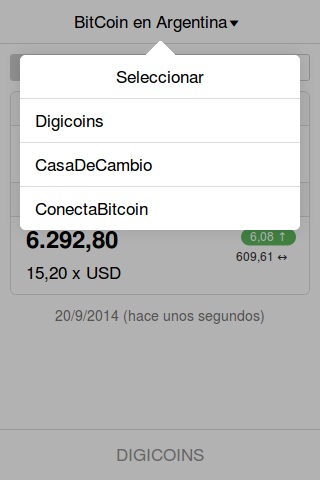
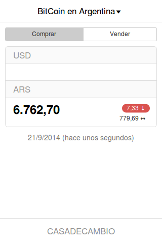

# Bitcoin en Argentina Core app

Built with the following libraries:

* [Ratchet][rtch]
* [localForage][fora]
* [numeral][nume]
* [moment][mome]
* [zepto][zpto]

## Rack or Node backends

Use any one of the available backends:

* Rack
* Node

## Copyright

(c)2014 Cristian R. Arroyo

[rtch]: http://goratchet.com
[fora]: http://mozilla.github.io/localForage/
[nume]: http://numeraljs.com
[mome]: http://momentjs.com/
[zpto]: http://zeptojs.com/
